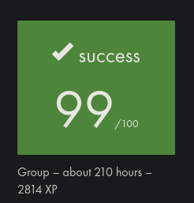

# Minishell

This project, completed as part of the curriculum at [42 Paris](https://42.fr/en/homepage/), involved creating a simplified Unix shell called **minishell**. The project was developed in collaboration with [Philadelphi](https://github.com/philadelphi).

**Minishell** replicates key functionalities of a Unix shell, including:  
- Displaying a prompt and processing user commands.  
- Handling command history with `readline`.  
- Searching and executing programs via relative/absolute paths and `$PATH`.  
- Managing environment variables, including `$?` for exit statuses.  
- Implementing pipes (`|`) and input/output redirections (`<`, `>`, `<<`, `>>`).  
- Supporting single and double-quoted strings with meta-character interpretation rules.  
- Handling built-in commands like `echo`, `cd`, `pwd`, `export`, `unset`, `env`, and `exit`.  
- Reacting appropriately to keyboard signals (`ctrl-C`, `ctrl-D`, `ctrl-\`).  

The implementation adheres to strict memory management and coding standards, ensuring minimal global variable usage and avoiding memory leaks in user-defined code.

Explore this project to see a fully functional, custom-built shell developed as a stepping stone to understanding operating systems and command-line interfaces.

<h2>Usage:</h2>
Simply clone, make and launch ./minishell. If necessary, install the readline C library via <code>sudo apt-get install libreadline6 libreadline6-dev</code>
  

 
