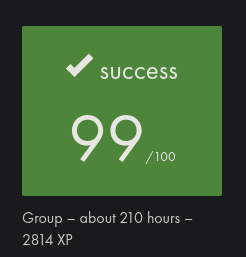

# minishell_42
The minishell project consists of coding a somewhat minimalist shell, taking bash as an exemple for implementing the following features and behaviors :
<ul>
<li>Syntax lexing/parsing.</li>
<li>Execution of simple commands using execve.</li>
<li>Recoding these builtin commands with no options : cd, pwd, env, export, unset, echo (with -n option).</li>
<li>Pipes (any number of them).</li>
<li>Redirections : <, <<, >, >>.</li>
<li>Variable expansion using the $ sign.</li>
<li>Accurate command exit codes as verified using the $? environment variable.</li>
<li>Signals (discriminating between interactive and non-interactive modes): Ctrl + C, Ctrl + D, Ctrl + \</li>
</ul>

<h3>Usage:</h3>
Simply clone, make and launch ./minishell. If necessary, install the readline C library via <code>sudo apt-get install libreadline6 libreadline6-dev</code>

